<!-- Profile Views Tracker -->
<p align="right">
  
</p>

# Hi there, I'm Jordy Montalvo! 👋

<!-- Theme-Sensitive Header Banner -->
<picture>
  <source media="(prefers-color-scheme: dark)" srcset="dark.svg">
  <source media="(prefers-color-scheme: light)" srcset="dark.svg">
  
</picture>

<!-- Quick Action & Connect Buttons -->
<p align="center">
  <a href="https://www.linkedin.com/in/jordy-joseph-montalvo-/" target="_blank">
    
  </a>
  <a href="https://portafolio-coral-nu.vercel.app/" target="_blank">
    
  </a>
  <a href="https://wa.me/51978509234?text=Hola%20Jordy,%20vi%20tu%20perfil%20de%20GitHub%20y%20me%20gustar%C3%ADa%20conversar%20sobre%20una%20oportunidad" target="_blank">
    
  </a>
  <a href="mailto:jordyjosephmontalvo@gmail.com">
    
  </a>
  <a href="https://github.com/JordyMontalvo?tab=repositories">
    
  </a>
</p>

---

## 🚀 About Me
I’m **Jordy Montalvo**, a Software Engineer specializing in **Artificial Intelligence** and **Full-Stack Development**. I build scalable, high-performance web applications and autonomous AI agent architectures beyond standard solutions, focusing on clean engineering, real-time interactivity, and enterprise robustness.

I work extensively with **React, Next.js, TypeScript, Python (FastAPI/Flask), Java Spring Boot, and Node.js**, bridging intelligent backend architectures with fluid, modern frontends. I'm passionate about **AI Multi-Agent Systems, RAG pipelines, and automated workflows** (LangChain, LangGraph, Qdrant, n8n), with solid experience deploying across **AWS, Google Cloud, Vercel, Docker, and Linux environments**.

> 💡 *"Every error is a lesson and every crash is an opportunity to rebuild stronger."*

- 🎓 **Education:** Software Engineering with Artificial Intelligence — SENATI (2021 - 2025).
- 📍 **Location:** Lima, Peru 🇵🇪 (Available for Remote / Hybrid / On-site).
- 💬 **Ask me about:** AI Agent workflows (RAG/MCP), Full-Stack architecture, or modern web apps.
- ✉️ **Contact:** [jordyjosephmontalvo@gmail.com](mailto:jordyjosephmontalvo@gmail.com)
- 🌐 **Portfolio:** [portafolio-coral-nu.vercel.app](https://portafolio-coral-nu.vercel.app/)

---

## 🏆 GitHub Achievements & Trophies

<p align="center">
  
</p>

---

## ⚙️ Engineering & Development Workflow

```mermaid
graph LR
    A[📋 System Design & Requirements] --> B[🤖 AI-Assisted Architecture]
    B --> C[💻 Clean Code, TDD & APIs]
    C --> D[🐳 Docker & CI/CD Automation]
    D --> E[☁️ Cloud Deployment & Monitoring]
